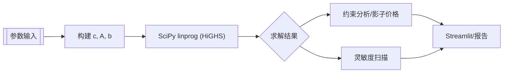

# 饮料生产优化模型注释与设计笔记

> 目标：说明 `beverage_optimization_model.py` 中新增注释背后的思路，并结合图示解释线性规划的求解流程。

## 1. 模型结构概览
- 决策变量：5 种饮料 SKU 的产量，统一以千升为单位，顺序与 `self.beverage_types` 一致，方便将求解结果映射回具体品类。
- 目标函数：最大化利润 `max c^T x`，在代码中通过 `c = -profits` 转换为 SciPy `linprog` 可处理的最小化问题。
- 约束系统：
  - 原料消耗（5 条）——使用 `material_consumption` 矩阵逐行生成；
  - 运输能力（5 条）——按区域需求权重分摊产量，再与 `transport_limits` 对比；
  - 产量下限与上限（各 5 条）——保障供应连续性并限制冲量生产。
- 求解器：统一使用 HiGHS（`method='highs'`），可在 CLI、测试或 Streamlit 环境中复用。

## 2. 数据流示意

> **注释亮点：**
> - 在 `build_matrices` 中对每一类约束加入双语注释，说明为何要用 `-1` 把 `>=` 约束翻译成标准形，及其对影子价格的作用；
> - 在 `solve_model` 增补了“构建矩阵→调用 HiGHS→封装结果”三个阶段的说明，使日志与调试信息可快速对照；
> - `analyze_constraints` 与 `sensitivity_analysis` 中增加了为什么要缓存 `slack`、如何迭代扫描利润/资源上限等解释，方便二次开发者按需扩展。

## 3. 约束与矩阵映射速查
| 约束类型 | 代码位置 | Ax <= b 形式说明 | 业务含义 |
| --- | --- | --- | --- |
| 原料消耗 | `build_matrices` 第 1 段循环 | `material_consumption[i] · x ≤ material_limits[i]` | 任一原料不能被过度使用 |
| 运输能力 | `build_matrices` 第 2 段循环 | `demand_weights[:, j] · x ≤ transport_limits[j]` | 区域运输瓶颈 | 
| 最小产量 | `build_matrices` 第 3 段循环 | `-x_i ≤ -min_production[i]` | 保持供应连续性 |
| 最大产量 | `build_matrices` 第 4 段循环 | `x_i ≤ 1.5 × previous_sales[i]` | 避免瞬时扩产风险 |

## 4. 灵敏度分析流程
1. 读取基础最优解与 `reduced_costs`，先生成文字化建议（如“利润过低需调整”）。
2. 对每个 SKU 以 10% 或 0.5 元为步长分别向上/向下扫描利润系数：
   - 创建 `test_model` 克隆对象，只改动一个利润系数；
   - 若新解与原最优解在 `1e-3` 范围内一致，则扩展可行范围；
   - 直至解发生变化或达到迭代上限。
3. 对 RHS（原料/运输）仅在“ binding ”约束上做同样的增减扫描，借助影子价格给出“多 1 单位资源→利润提升多少”的解释。
4. 汇总得到 `analysis['objective_coefficients']`、`analysis['rhs_changes']` 和 `recommendations` 三大板块。

## 5. 如何使用本文件
- 在 Streamlit/CLI 中直接调用 `model.solve_model()`，返回结果已经包含注释所述的全部字段，可直接映射到图表或报告。
- 若要做场景分析，只需调用 `model.update_parameters({...})`，新的注释说明了每个键值的意义以及与 UI 滑块的对应关系。
- 当需要对个人项目撰写技术文档时，可引用本文件的 Mermaid 流程图或表格，快速展示“输入→矩阵→求解→洞察”的链路。

## 6. 单纯形法迭代表可视化
为 Streamlit 和静态 HTML 页面提供更直观的算法说明，下面加入了完全矢量化的单纯形表 SVG 图像，文档更新后部署页会自动引用最新版内容。

- 画面展示了两次关键迭代的 pivot 过程，SVG 由仓库内联渲染，发布后无需额外静态资源。
- 使用 HTML `
` 折叠块保证默认收起，页面加载时不会占据主视觉空间。

👉 点击展开查看单纯形法迭代表 SVG 图像

<figure>
<svg width="720" height="240" viewBox="0 0 720 240" xmlns="http://www.w3.org/2000/svg" role="img" aria-labelledby="simplex-iter0-title">
  <title id="simplex-iter0-title">单纯形法迭代 0 - 初始单纯形表</title>
  
  <rect x="0" y="0" width="720" height="240" rx="18" fill="#f8fafc" stroke="#e2e8f0"/>
  <text x="30" y="35" class="title">迭代 0 · 初始单纯形表</text>
  <text x="520" y="35" class="subtitle">入基: x₁ | 出基: s₁</text>
  <rect x="20" y="70" width="130" height="34" class="header-cell"/>
  <text x="85" y="87" class="header-text">基变量</text>
  <rect x="150" y="70" width="90" height="34" class="header-cell"/>
  <text x="195" y="87" class="header-text">x₁</text>
  <rect x="240" y="70" width="90" height="34" class="header-cell"/>
  <text x="285" y="87" class="header-text">x₂</text>
  <rect x="330" y="70" width="90" height="34" class="header-cell"/>
  <text x="375" y="87" class="header-text">x₃</text>
  <rect x="420" y="70" width="90" height="34" class="header-cell"/>
  <text x="465" y="87" class="header-text">s₁</text>
  <rect x="510" y="70" width="90" height="34" class="header-cell"/>
  <text x="555" y="87" class="header-text">s₂</text>
  <rect x="600" y="70" width="100" height="34" class="header-cell"/>
  <text x="650" y="87" class="header-text">RHS</text>
  <rect x="20" y="110" width="130" height="32" class="data-cell"/>
  <text x="85" y="126" class="cell-text">s₁</text>
  <rect x="150" y="110" width="90" height="32" class="pivot-cell"/>
  <text x="195" y="126" class="cell-text">2</text>
  <rect x="240" y="110" width="90" height="32" class="data-cell"/>
  <text x="285" y="126" class="cell-text">1</text>
  <rect x="330" y="110" width="90" height="32" class="data-cell"/>
  <text x="375" y="126" class="cell-text">0</text>
  <rect x="420" y="110" width="90" height="32" class="data-cell"/>
  <text x="465" y="126" class="cell-text">1</text>
  <rect x="510" y="110" width="90" height="32" class="data-cell"/>
  <text x="555" y="126" class="cell-text">0</text>
  <rect x="600" y="110" width="100" height="32" class="data-cell"/>
  <text x="650" y="126" class="cell-text">240</text>
  <rect x="20" y="146" width="130" height="32" class="data-cell"/>
  <text x="85" y="162" class="cell-text">s₂</text>
  <rect x="150" y="146" width="90" height="32" class="data-cell"/>
  <text x="195" y="162" class="cell-text">1</text>
  <rect x="240" y="146" width="90" height="32" class="data-cell"/>
  <text x="285" y="162" class="cell-text">3</text>
  <rect x="330" y="146" width="90" height="32" class="data-cell"/>
  <text x="375" y="162" class="cell-text">1</text>
  <rect x="420" y="146" width="90" height="32" class="data-cell"/>
  <text x="465" y="162" class="cell-text">0</text>
  <rect x="510" y="146" width="90" height="32" class="data-cell"/>
  <text x="555" y="162" class="cell-text">1</text>
  <rect x="600" y="146" width="100" height="32" class="data-cell"/>
  <text x="650" y="162" class="cell-text">360</text>
  <rect x="20" y="182" width="130" height="32" class="data-cell"/>
  <text x="85" y="198" class="cell-text">Z</text>
  <rect x="150" y="182" width="90" height="32" class="data-cell"/>
  <text x="195" y="198" class="cell-text">-5</text>
  <rect x="240" y="182" width="90" height="32" class="data-cell"/>
  <text x="285" y="198" class="cell-text">-4</text>
  <rect x="330" y="182" width="90" height="32" class="data-cell"/>
  <text x="375" y="198" class="cell-text">-3</text>
  <rect x="420" y="182" width="90" height="32" class="data-cell"/>
  <text x="465" y="198" class="cell-text">0</text>
  <rect x="510" y="182" width="90" height="32" class="data-cell"/>
  <text x="555" y="198" class="cell-text">0</text>
  <rect x="600" y="182" width="100" height="32" class="data-cell"/>
  <text x="650" y="198" class="cell-text">0</text>
  <text x="30" y="222" class="note">最小比值检验：s₁ 行 240 ÷ 2 = 120，s₂ 行 360 ÷ 1 = 360 → 选 s₁ 离基</text>
</svg>
<figcaption style="margin-top:0.5rem;font-size:0.9rem;color:#475569;">初始基为 s₁ 和 s₂，x₁ 列的 reduced cost 最负，通过最小比值选择 s₁ 离基。</figcaption>
</figure>

<figure style="margin-top:1.5rem;">
<svg width="720" height="240" viewBox="0 0 720 240" xmlns="http://www.w3.org/2000/svg" role="img" aria-labelledby="simplex-iter1-title">
  <title id="simplex-iter1-title">单纯形法迭代 1 - pivot 后</title>
  
  <rect x="0" y="0" width="720" height="240" rx="18" fill="#f8fafc" stroke="#e2e8f0"/>
  <text x="30" y="35" class="title">迭代 1 · 枢轴完成后</text>
  <text x="520" y="35" class="subtitle">入基: x₂ | 出基: s₂</text>
  <rect x="20" y="70" width="130" height="34" class="header-cell"/>
  <text x="85" y="87" class="header-text">基变量</text>
  <rect x="150" y="70" width="90" height="34" class="header-cell"/>
  <text x="195" y="87" class="header-text">x₁</text>
  <rect x="240" y="70" width="90" height="34" class="header-cell"/>
  <text x="285" y="87" class="header-text">x₂</text>
  <rect x="330" y="70" width="90" height="34" class="header-cell"/>
  <text x="375" y="87" class="header-text">x₃</text>
  <rect x="420" y="70" width="90" height="34" class="header-cell"/>
  <text x="465" y="87" class="header-text">s₁</text>
  <rect x="510" y="70" width="90" height="34" class="header-cell"/>
  <text x="555" y="87" class="header-text">s₂</text>
  <rect x="600" y="70" width="100" height="34" class="header-cell"/>
  <text x="650" y="87" class="header-text">RHS</text>
  <rect x="20" y="110" width="130" height="32" class="data-cell"/>
  <text x="85" y="126" class="cell-text">x₁</text>
  <rect x="150" y="110" width="90" height="32" class="data-cell"/>
  <text x="195" y="126" class="cell-text">1</text>
  <rect x="240" y="110" width="90" height="32" class="data-cell"/>
  <text x="285" y="126" class="cell-text">0.5</text>
  <rect x="330" y="110" width="90" height="32" class="data-cell"/>
  <text x="375" y="126" class="cell-text">0</text>
  <rect x="420" y="110" width="90" height="32" class="data-cell"/>
  <text x="465" y="126" class="cell-text">0.5</text>
  <rect x="510" y="110" width="90" height="32" class="data-cell"/>
  <text x="555" y="126" class="cell-text">0</text>
  <rect x="600" y="110" width="100" height="32" class="data-cell"/>
  <text x="650" y="126" class="cell-text">120</text>
  <rect x="20" y="146" width="130" height="32" class="data-cell"/>
  <text x="85" y="162" class="cell-text">s₂</text>
  <rect x="150" y="146" width="90" height="32" class="data-cell"/>
  <text x="195" y="162" class="cell-text">0</text>
  <rect x="240" y="146" width="90" height="32" class="pivot-cell"/>
  <text x="285" y="162" class="cell-text">2.5</text>
  <rect x="330" y="146" width="90" height="32" class="data-cell"/>
  <text x="375" y="162" class="cell-text">1</text>
  <rect x="420" y="146" width="90" height="32" class="data-cell"/>
  <text x="465" y="162" class="cell-text">-0.5</text>
  <rect x="510" y="146" width="90" height="32" class="data-cell"/>
  <text x="555" y="162" class="cell-text">1</text>
  <rect x="600" y="146" width="100" height="32" class="data-cell"/>
  <text x="650" y="162" class="cell-text">240</text>
  <rect x="20" y="182" width="130" height="32" class="data-cell"/>
  <text x="85" y="198" class="cell-text">Z</text>
  <rect x="150" y="182" width="90" height="32" class="data-cell"/>
  <text x="195" y="198" class="cell-text">0</text>
  <rect x="240" y="182" width="90" height="32" class="data-cell"/>
  <text x="285" y="198" class="cell-text">-1.5</text>
  <rect x="330" y="182" width="90" height="32" class="data-cell"/>
  <text x="375" y="198" class="cell-text">-3</text>
  <rect x="420" y="182" width="90" height="32" class="data-cell"/>
  <text x="465" y="198" class="cell-text">2.5</text>
  <rect x="510" y="182" width="90" height="32" class="data-cell"/>
  <text x="555" y="198" class="cell-text">0</text>
  <rect x="600" y="182" width="100" height="32" class="data-cell"/>
  <text x="650" y="198" class="cell-text">600</text>
  <text x="30" y="222" class="note">下一步 pivot 在 x₂ 列：s₂ 行 240 ÷ 2.5 = 96 &lt; 120 ÷ 0.5 → 选择 s₂ 离基</text>
</svg>
<figcaption style="margin-top:0.5rem;font-size:0.9rem;color:#475569;">完成第一个 pivot 之后，第二轮由 x₂ 入基，图中高亮帮助业务同学定位下一次换基。</figcaption>
</figure>

